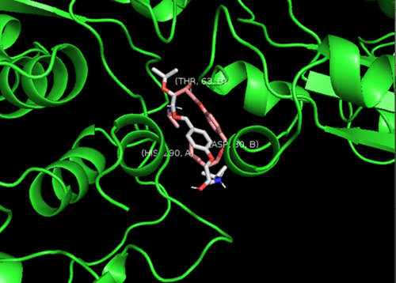
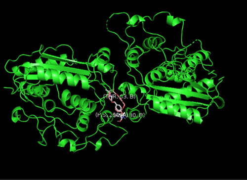
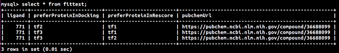

# 針對特定蛋白尋找可能的治療藥物-:
This script is a demo to screening possible drug as the inhibitor to the specific protein with the software, Smina.

        $sh ./docking.sh

The R-package ,Bio3d and the rescoring function of Smina are used to improve screening accruacy. 
And you can revise loop condition to run complete process. It might take 3-4 or more days.

**[optional]**  You can use buildSql.sh to build a MySQL table of PubChem pages of  possible drug information.(pubchempy should be installd by "$sudo pip install pubchempy")

        $sh ./buildSql.sh
        $firefox -new-tab "https://pubchem.ncbi.nlm.nih.gov/compound/$page"

# prerequisites:

# 1)tools:

  * R-package 'Bio3d'
  * Gromacs
  * Pymol
  * MGLTools
  * Open Babel
  * Smina

# 2)input files:

  * nma.r
  * correctMode.sh
  * forAlignPml.sh
  * bindingSite.r
  * fda.mol2
         

# demo and output:

simulated possible condition which drug molecule(stick structure) fills in the position of protein(green)

   

# optioinal output:

